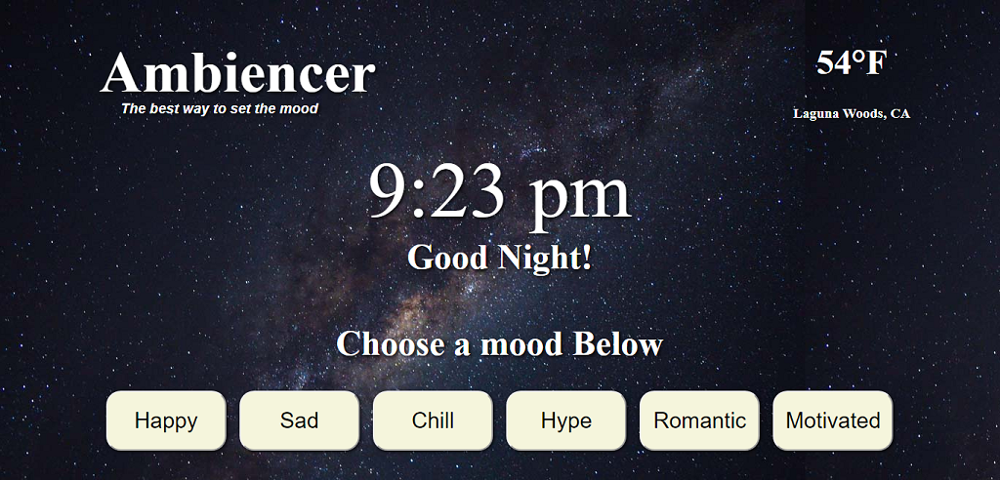

# Ambiencer

## Overview

Ambiencer allows you to choose a mood and it will gather music, a poem, some news and a random GIF based on what was chosen.

## Technologies Used

Ambiencer was built using Javascript/Jquery with CSS/Flexbox.

Content is retrieved via AJAX calls to the following API sources...  

1. Pixabay - [pixabay.com/api/docs](https://pixabay.com/api/docs)
2. Weather - [weather.gov](http://weather.org)
3. Youtube - [developers.google.com/youtube](http://developers.google.com/youtube)
4. NewsAPI - [newsapi.org](http://newsapi.org)
5. PoetryDB - [poetrydb.org](http://poetrydb.org)
6. Giphy - [developers.giphy.com](http://developers.giphy.com)